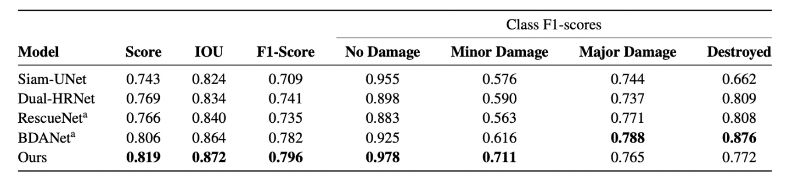
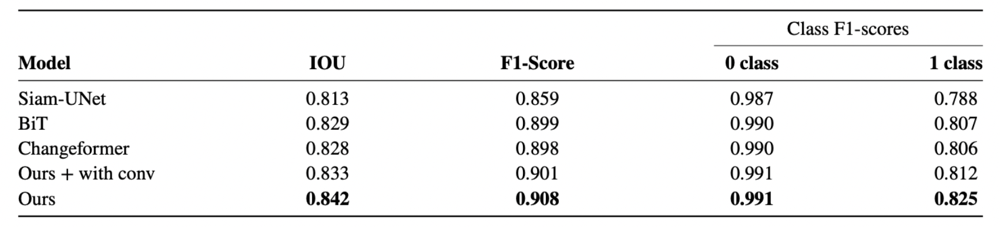

# DAHiTra: UNET Architecture with Hierarchical Transformers for Automated Building Damage Assessment Using Satellite Imagery

A novel transformer-based network model is presented for building damage assessment which leverages hierarchical spatial features of multiple resolutions and captures temporal difference in feature domain after applying transformer encoder
on the spatial features. The proposed network achieves state of the art performance while tested on a large-scale disaster damage dataset (xBD) for building localization and damage classification, as well as on LEVIR-CD dataset for change detection
tasks.

Publication accepted in CACAIE (peer-reviewed journal): [https://onlinelibrary.wiley.com/doi/10.1111/mice.12981](https://onlinelibrary.wiley.com/doi/10.1111/mice.12981)

Arxiv link: https://arxiv.org/abs/2208.02205
## Results

#### Average Quantitative Results for Damage Classification: xBD dataset


#### Average Quantitative Results for Change Detection: LEVIR-CD dataset



## Training the model

#### Requirements
```
Python 3.6
pytorch 1.6.0
torchvision 0.7.0
einops  0.3.0
```

#### Installation

Clone this repo:
```shell
git clone https://github.com/nka77/DamageAssessment.git
cd DamageAssessment
```

#### Training the model
Please refer the training script `run_cd.sh` and the evaluation script `eval.sh` in the folder `scripts`. 

Training goal specific files:
1. Classification: xBD_code/train.py
2. Localization: xBD_code/train_loc.py
3. Domain adaptation: xBD_code/train_adapt.py

### Dataset Preparation

#### Data Download 

1. xBD: https://xview2.org/dataset
2. LEVIR-CD: https://justchenhao.github.io/LEVIR/

#### Required data format
```
"""
xBD damage classification data set with pixel-level binary labels；
├─train
    |-images
    ├─masks
├─tier3
    |-images
    ├─masks
├─test
    |-images
"""
```
`train` and `tier3` : pre-disaster and post-disaster images;
`masks`: 5 class label maps;
```
"""
LEVIR Change detection data set with pixel-level binary labels；
├─A
├─B
├─label
└─list
"""
```
`A`: images of t1 phase;
`B`:images of t2 phase;
`label`: label maps;
`list`: contains `train.txt, val.txt and test.txt`, each file records the image names (XXX.png) in the change detection dataset.


## Acknowledgements

We thank https://github.com/justchenhao/BIT_CD.git for providing the code base publicly. We develop our code on the top of this repository.
